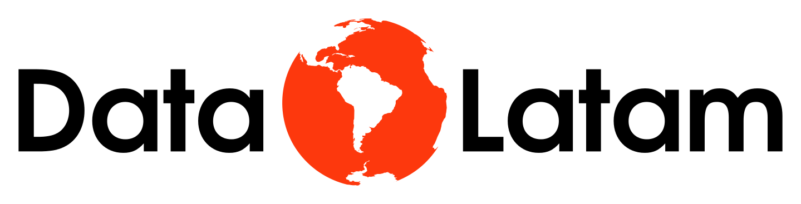

<!-- README.md is generated from README.Rmd. Please edit that file -->

```{r, include = FALSE}
knitr::opts_chunk$set(
  collapse = TRUE,
  comment = "#>",
  fig.path = "man/figures/README-",
  out.width = "80%"
)
options(tibble.print_min = 5, tibble.print_max = 5)
```

# Curso Profesional Visualización de datos con R <a href='http://www.datalatam.com/'></a>


<!-- badges: start -->
<!-- badges: end -->

Este repositorio contiene el material usado durante el curso. Todos los ejemplos
así como la presentación están aquí contenidos. 

## Preparación 
No importa el sistema operativo que usas, siempre y cuando permita la instalación de una versión reciente de R y RStudio (Windows, OSX y Linux). Antes de comenzar con los ejemplos por favor verifica lo siguiente.

### **Que tienes una versión de R actualizada** 
Vamos a trabajar con la versión 3.6.0 Para verificar la versión que tienes instalada puedes correr en la consola:

```{r version R}
R.Version()$version.string
```

La respuesta debería ser por lo menos (puede ser una versión más reciente):

    [1] "R version 3.6.2 (2019-12-12)"

Si necesitas actualizar por favor visita la página correspondiente de 
[r-project.org](https://cloud.r-project.org/)

### **Que tienes una version de RStudio Actualizada**
En RStudio busca la opción en el menú Help >About RStudio. Busca si tienes Versión 1.2.5.033 o mayor. Si es menor instala una versión nueva ya sea con Help > Check for Updates o visitando las páginas de RStudio para bajar una nueva versión compatible con tu sistema:

https://www.rstudio.com/products/rstudio/download/#download

### **Que tienes los paquetes necesarios**
Para que estés segur@ de tener todos los paquetes que vamos a utilizar lo mejor es que los instales de antemano. Con las siguientes instrucciones los puedes instalar todos:

    install.packages(c("ggplot2", "dplyr", "readr", "plotly", "janitor",
                        "readxl", "scales", "stringr", "lubridate", "viridis",
                        "listviewer", "rmarkdown")) 

## Organiza
Este evento lo organiza [Data Latam](http://wwww.datalatam.com) en cooperación con [ixpantia](https://www.ixpantia.com). Data Latam es una comunidad Latinoamericana de profesionales y académicos aplicando ciencia de datos en su día a día en la industria de datos en Latino América. En los eventos, cursos y programas de extensión exploramos tecnologías, aprendemos sobre ciencia de datos, hablamos de tendencias y eventos relevantes de la industria, y compartimos novedades del sector.
